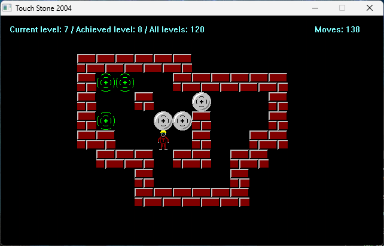

# Touch Stone
## About
Touch Stone is easy 2D game created without any game engine.  
The goal of the game is to get the stones into the holes.

*Levels data are not from my head.*

The author of most of the graphics is **Chris Hamons**:  
[OpenGameArt.Org - Dungeon Crawl 32x32 tiles](https://opengameart.org/content/dungeon-crawl-32x32-tiles)  
[Google Code - Dungeon Crawl 32x32 tiles](https://code.google.com/archive/p/crawl-tiles/)

## Controls
- Alt+F4 - Exit application  
- Escape - Minimize application  
- Arrows or W,A,S,D or I,J,K,L - Player move  
- 0-9 - Change graphic set  
- Plus - Next Level  
- Minus - Prev Level  
- Back - Restart level  

## Screenshots
  
  

